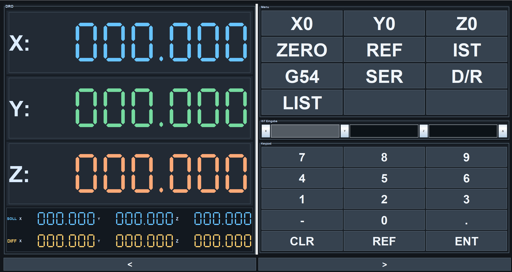
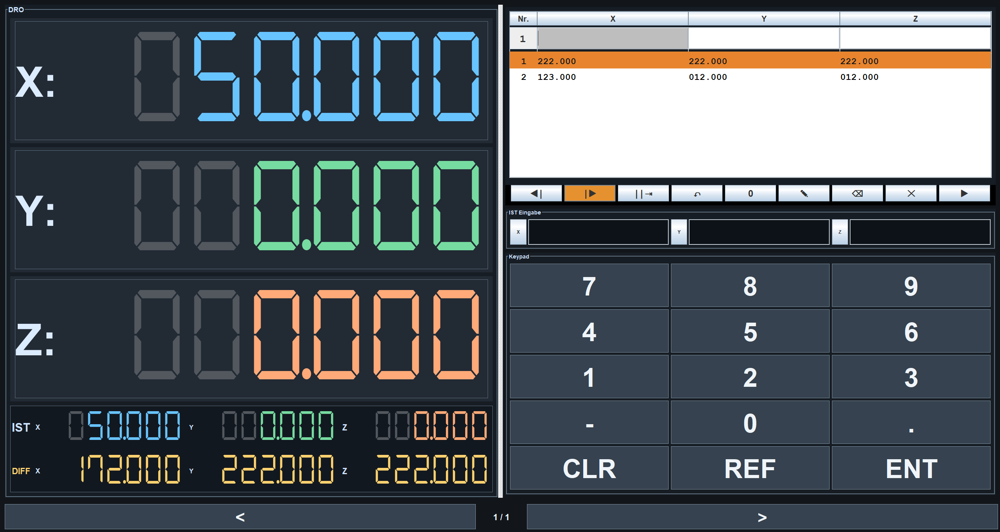

# Future-DRO-Desktop
Java based Desktop Milling DRO, Bluetooth or USB (Ongoing)

# TouchDRO Desktop

Future DRO Desktop is a touch-friendly Java Swing digital readout (DRO) for a three-axis milling or drilling machine. It displays live X, Y, and Z positions from TouchDroid ESP32 hardware and provides reference-point workflows for manually guided machining.

## Features

- Large, scalable seven-segment X/Y/Z readout.
- Switchable actual-position and delta-to-target display.
- Direct X/Y/Z actual-position entry through either a physical keyboard or the on-screen keypad.
- Touch-friendly keypad, large navigation controls, and a scalable 4 by 3 menu grid.
- Reference-point list editor with selectable active point, point editing, deletion, and navigation.
- Empty coordinate handling for new points: require all values, use `0.000`, or inherit values from the preceding point.
- Named reference lists stored as CSV files in `referenzlisten/`.
- Configurable X/Y tool-radius compensation using either a radius or diameter input; Z remains uncompensated.
- USB serial connection to TouchDroid hardware through `jSerialComm`.


## Screenshots





## Hardware Protocol

The ESP32 firmware sends one telemetry line every 50 ms through USB serial at `115200` baud:

```text
X=<micrometres>,Y=<micrometres>,Z=<micrometres>
```

Example:

```text
X=125000,Y=-4500,Z=30000
```

The desktop application converts these values to millimetres before displaying them. Use the `SER` menu item to select and connect to the ESP32 COM port.

## Reference Lists

Reference lists are stored in the application directory under `referenzlisten/` as CSV files:

```csv
X_mm,Y_mm,Z_mm
0.000,0.000,0.000
100.000,20.000,-5.000
```

Use the `LIST` menu item to manage multiple files without a system file browser. The application creates the folder automatically the first time a list is saved.

## Requirements

- Java 17 or later.
- `jSerialComm 2.11.0` for USB serial communication.
- Optional: a TouchDroid-compatible ESP32 device connected through USB.

The dependency is declared in `pom.xml`. For direct compilation, place `jSerialComm-2.11.0.jar` in `lib/`.

## Run

### Maven

```bash
mvn package
java -cp target/classes com.drodesktop.Main
```

### Direct Java compilation

Windows PowerShell:

```powershell
$driver = '.\lib\jSerialComm-2.11.0.jar'
$files = Get-ChildItem -Path '.\src\main\java' -Recurse -Filter '*.java' | Select-Object -ExpandProperty FullName
javac -cp $driver -d '.\target\classes' --release 17 $files
java --enable-native-access=ALL-UNNAMED -cp ".\target\classes;$driver" com.drodesktop.Main
```

## Screenshots


## Project Layout

- `src/main/java/com/drodesktop/Main.java`: application entry point.
- `src/main/java/com/drodesktop/ui/DROFrame.java`: Swing user interface and workflows.
- `src/main/java/com/drodesktop/DRO.java`: machine and reference-list state.
- `src/main/java/com/drodesktop/service/SerialDroReceiver.java`: USB serial telemetry receiver.
- `src/main/java/com/drodesktop/ui/SevenSegmentLabel.java`: scalable seven-segment display label.
